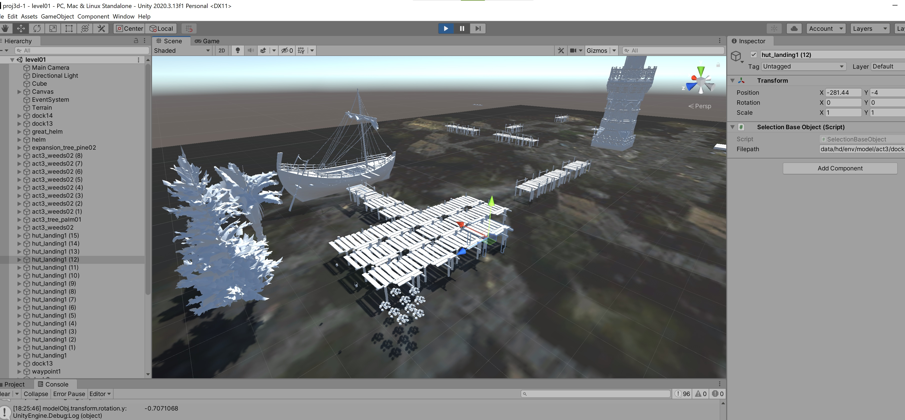
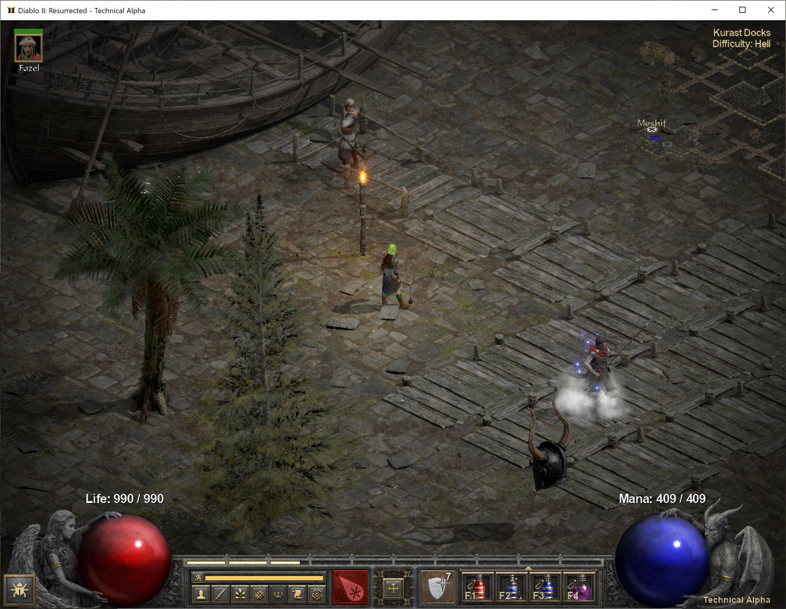

## Unity D2R Scene Editor
Use unity to edit position, rotation and scale of D2R models in a level preset. (Python is also required for running a json script)

### Create 3D Scene in Unity
- Launch [Unity](https://store.unity.com/download-nuo) and create a new 3d project and a level
- Add the `saveJson.cs` script to a GameObject of a new 3d project level
- Import model files (`.fbx`, `.dae` format) into Unity Assets. D2R's `.model` files can be converted to `.fbx` and `.dae` format with Noesis and the D2R_Reader plugin (see [Credits and Tools](#credits-and-tools))
- Click `Play` and `Pause` then position models in the scene and add the `SelectionBaseObject.cs` script using the Inspector window on the right. (Identical models can be copy-pasted in the Scene Editor)
- Each model object should have the `Filepath` variable set in Unity (in the Inspector window) to the path of the `.model` file that D2R uses. E.g. `data/hd/env/model/act3/docktown/act3_docktown_docks/dock01.model` for an act3 dock
- Click `Play` again once done editing and then click the `Save` button in the upper left of the Scene window

### Unity Appends to D2R Preset
- The Unity `Save` script loops through all models on the scene and appends them to a base json D2R preset file
- Change the paths to `docktown_base` and `docktown_final` on lines 7 and 8 in the file `preset_update.py` so they point at locations on your system
- Launch D2R with the `docktown_final` json file in your D2R's data preset folder and see the model positions in-game

### Credits and Tools
- Noesis model viewer and converter https://richwhitehouse.com/index.php?content=inc_projects.php
- D2R_reader plugin for Noesis https://forum.xentax.com/viewtopic.php?f=16&t=22277&start=165#p173650
- D2R texture format https://github.com/CucFlavius/Zee-010-Templates/blob/main/DiabloIIResurrected_Texture.bt

### Copyrights
Models and images are copyrighted by Blizzard Entertainment.
