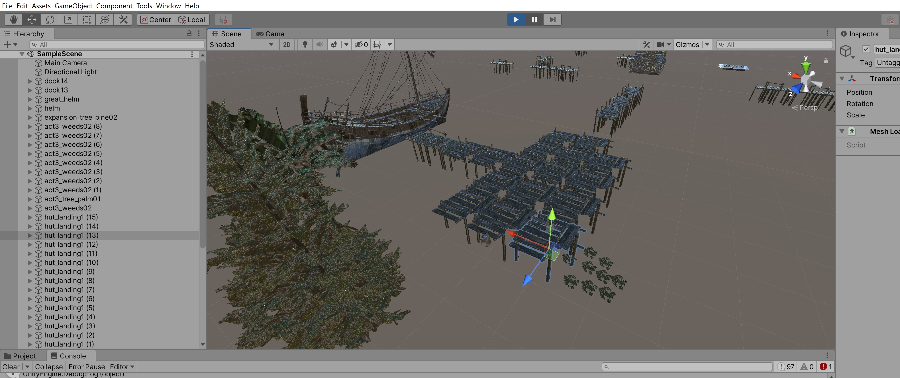
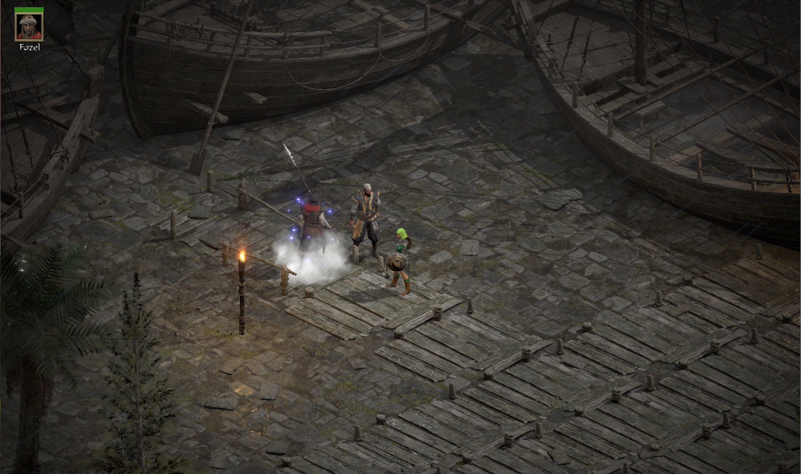

## Unity-D2R-Scene-Editor
Edit D2R preset environments in Unity. *A purchased copy of D2R is required to access the data files*.

1. Create a new 3D project in Unity (this example project is named "D2R-docktown")
2. Copy the `Scripts/` folder to your unity project Assets folder (e.g. `...Unity Projects\D2R-docktown\Assets\Scripts`)
3. Copy the `libs/` and `Resources/` folders to your unity project Assets folder
4. Open the project in Unity and select the `Main Camera` objects in the Scene. Then in the `Inspector` window on the right hand side add the script `SaveJson.cs`. (This is done only once per project)
5. Save your Unity Scene with `ctrl+s`. Set your D2R data paths in`SaveJson.cs` and save the file [see below](#config-data-paths)
6. Click the "Play" button above the `Scene` window to load a json preset in the project folder (e.g. `docktown3.json`). Click "Pause" and move/rotate/scale objects in the Scene
7. To add objects to the Scene click "Pause" to unpause and then click the "Add" button and specify the path of the model to add. Once objects have been added click "Pause" to go back to Scene editing 
8. Click "Pause" once again to unpause when finished editing and then click "Save" to save your changes to the preset json file
9. Place your edited preset json into your D2R/Data/hd/env/preset location and launch D2R with `-direct -txt`


## Config Data Paths
Lines 16 and 17 in `SaveJson.cs` should be configured for your D2R data paths and preset path
```cs
    public string preset = "docktown3.json";              // Change this to be the json preset that is edited
    public static string d2rDataPath = "D:/D2R/";         // Change this to where your D2R data is extracted (casc storage)
```


## Unity
Freely available here https://store.unity.com/download-nuo


## Screenshots





### Credits and Tools
- D2RStudio by Shalzuth http://web.archive.org/web/20210508115732/github.com/shalzuth/d2rstudio
- LSLib by Norbyte https://github.com/Norbyte/lslib
- Noesis model viewer and converter https://richwhitehouse.com/index.php?content=inc_projects.php
- D2R_reader plugin for Noesis https://forum.xentax.com/viewtopic.php?f=16&t=22277&start=165#p173650
- D2R texture format https://github.com/CucFlavius/Zee-010-Templates/blob/main/DiabloIIResurrected_Texture.bt


### Copyrights
Diablo II and Diablo II: Resurrected are [copyrighted](https://www.blizzard.com/en-us/legal/9c9cb70b-d1ed-4e17-998a-16c6df46be7b/copyright-notices) by Blizzard Entertainment, Inc. All rights reserved. Diablo II, Diablo II: Resurrected and Blizzard Entertainment are [trademarks](https://www.blizzard.com/en-us/legal/9c9cb70b-d1ed-4e17-998a-16c6df46be7b/copyright-notices) or registered trademarks of Blizzard Entertainment, Inc. in the U.S. and/or other countries.  
All trademarks referenced here are the properties of their respective owners.

This project and its maintainers are not associated with or endorsed by Blizzard Entertainment, Inc.
